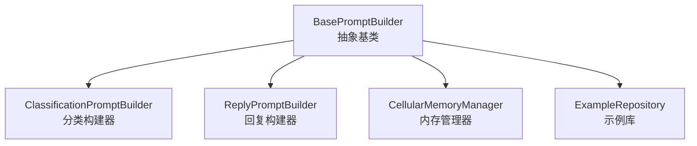
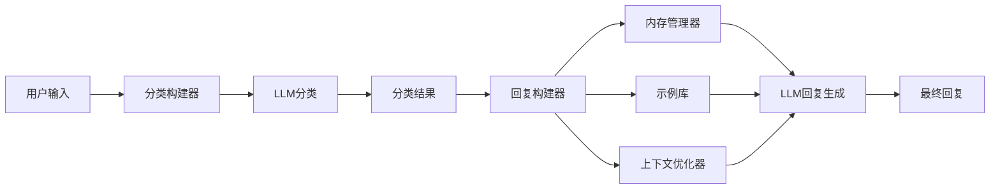

# Prompt Engineering 模块架构文档

## 概述

本文档详细解释prompt-engineering模块的功能逻辑和架构设计。该模块基于**Context Engineering**原则设计，实现了一套完整的AI提示构建框架，专门用于智能招聘助手的分类和回复生成。

## 核心架构关系

### 1. BasePromptBuilder 与子类的关系



#### 1.1 BasePromptBuilder（抽象基类）

**作用**: 定义Context Engineering的核心架构和通用方法
- **职责**: 
  - 提供抽象方法定义（buildAtomicSystemPrompt、buildMolecularPrompt等）
  - 实现通用工具方法（格式化、token估算、相似度计算）
  - 为未来Neural Field架构预留接口
- **设计模式**: 模板方法模式 + 策略模式

#### 1.2 ClassificationPromptBuilder（分类构建器）

**作用**: 专门负责消息意图分类的提示构建
- **继承关系**: 继承BasePromptBuilder，实现抽象方法
- **核心功能**:
  - 实现16种招聘场景的精准意图识别
  - 提供结构化JSON输出格式
  - 集成分类示例库和上下文优化
- **输出**: 用于LLM分类的system和user prompt

#### 1.3 ReplyPromptBuilder（回复构建器）

**作用**: 专门负责智能回复生成的提示构建
- **继承关系**: 继承BasePromptBuilder，实现抽象方法
- **核心功能**:
  - 集成Cellular Memory管理
  - 实现Few-shot Learning示例选择
  - 包含角色定义和上下文优化
  - 智能品牌过滤和候选人信息格式化
  - 智能候选人相关性评分（考虑服务行业特殊需求）
  - 完整候选人信息提取（姓名、性别、期望薪资、健康证等）
- **输出**: 用于LLM生成回复的system和user prompt

### 2. 组件协作关系



## Cellular Memory Manager 机制原理

### 2.1 三层记忆架构

CellularMemoryManager实现了一个**三层记忆系统**，模拟人脑的记忆机制：

```
短期记忆 (Short-term Memory)
├── 最近对话历史
├── 完整保存用户-助手交互
└── 按时间顺序存储

工作记忆 (Working Memory)  
├── 当前会话临时状态
├── 键值对存储
└── 支持复杂数据类型

长期记忆 (Long-term Memory)
├── 提取的关键事实
├── 按类型聚合压缩
└── 持久化重要信息
```

### 2.2 核心工作流程

1. **信息输入阶段**:
   ```typescript
   // 更新内存
   updateMemory({
     user: "用户消息",
     assistant: "助手回复"
   });
   ```

2. **事实提取阶段**:
   ```typescript
   // 使用正则模式提取关键信息
   EXTRACTION_PATTERNS = {
     location: /(?:在|位于|地址|位置)[：:]\s*([^\s，。]+)/g,
     age: /(\d+)\s*岁/g,
     brand: /品牌[：:]\s*([^\s，。]+)/g,
     schedule: /(?:时间|排班)[：:]\s*([^\s，。]+)/g,
   }
   ```

3. **内存优化阶段**:
   ```typescript
   getOptimizedContext(tokenBudget) {
     // 预先截断对话历史，避免溢出
     const maxHistorySize = Math.floor(budget * 0.3); // 30%用于历史
     const maxEntries = Math.min(
       Math.floor(maxHistorySize * TOKEN_ESTIMATE_DIVISOR / 120), // 120字符/条
       20 // 最多20条历史
     );
     // 保留最近的对话
     const recentHistory = this.shortTermMemory.slice(-maxEntries);
   }
   ```

### 2.3 内存压缩策略

- **Token预算分配**: 30%给对话历史，70%给其他上下文
- **对话历史限制**: 最多保留20条最近对话
- **长期记忆压缩**: 按类型聚合，每类最多保留3个事实
- **清理机制**: 定期清理超出限制的长期记忆

## Context Engineering 核心思想体现

### 3.1 Atomic Prompting（原子化提示）

**核心思想**: 将复杂提示分解为标准化的原子组件

**体现位置**:
- `buildAtomicSystemPrompt()` 方法
- 标准化的结构: Role → Task → Constraints → OutputFormat

```typescript
// 原子化提示结构
{
  role: {
    identity: "资深餐饮连锁招聘专员",
    expertise: "3年以上餐饮行业招聘经验，成功招聘800+名员工",
    personality: "耐心细致、热情专业、善于沟通",
    background: "熟悉各岗位要求，了解候选人关切点，擅长快速匹配人岗"
  },
  task: "生成专业招聘助手对候选人的回复",
  constraints: [...],
  outputFormat: {...}
}
```

### 3.2 Molecular Context（分子级上下文）

**核心思想**: 将相关上下文信息组织成结构化的分子级单元

**体现位置**:
- `buildMolecularPrompt()` 方法
- `ContextOptimizer` 类的上下文优化
- 结构化的上下文组织

```typescript
// 分子级上下文结构
MolecularContext {
  instruction: "任务指令",
  examples: [Few-shot示例],
  context: {
    conversationState: {...},    // 对话状态
    businessData: "...",         // 业务数据
    candidateProfile: {          // 候选人档案（增强版）
      name: "候选人姓名",
      gender: "性别",
      age: "年龄",
      position: "期望职位",
      expectedSalary: "期望薪资",
      expectedLocation: "期望工作地",
      height: "身高",
      weight: "体重",
      healthCertificate: "是否有健康证",
      activeTime: "最近活跃时间",
      relevanceScore: "智能匹配度评分"
    },
    extractedFacts: {...}        // 提取事实
  },
  newInput: "新的输入"
}
```

### 3.3 Cellular Memory（细胞级记忆）

**核心思想**: 模拟生物细胞的记忆机制，实现智能的上下文管理

**体现位置**:
- `CellularMemoryManager` 类的完整实现
- 三层记忆架构（短期、工作、长期）
- 智能压缩和优化机制

```typescript
// 细胞级记忆结构
OptimizedMemoryContext {
  recent: string[],                    // 最近对话
  facts: CompressedLongTermMemory,     // 压缩的长期事实
  working: WorkingMemoryRecord         // 工作记忆
}
```

### 3.4 Neural Field（神经场预留）

**核心思想**: 为未来的向量化语义搜索预留接口

**体现位置**:
- BasePromptBuilder中的预留方法
- `getSemanticVector()` 和 `registerToField()` 方法接口

## 配置参数详解

### 4.1 BuilderConfig（构建器配置）

| 参数 | 类型 | 默认值 | 推荐值 | 作用 |
|------|------|--------|--------|------|
| maxExamples | number | 3 | 2-5 | 控制Few-shot示例数量，影响上下文丰富度和token消耗 |
| tokenBudget | number | 3000 | 2500-4000 | Token预算限制，影响提示长度和内容截断策略 |
| enableMemory | boolean | true | true | 是否启用Cellular Memory管理 |
| experimentalFieldSupport | boolean | false | false | 实验性Neural Field支持（暂未实现） |

### 4.2 ContextOptimizerConfig（上下文优化配置）

| 参数 | 类型 | 默认值 | 推荐值 | 作用 |
|------|------|--------|--------|------|
| prioritizeBrandSpecific | boolean | false | false | 是否优先品牌特定信息（过滤非目标品牌） |
| includeConversationHistory | boolean | true | true | 是否包含对话历史 |
| maxHistoryLength | number | 5 | 5-10 | 最大对话历史长度 |
| includeExtractedFacts | boolean | true | true | 是否包含提取的事实信息 |

### 4.3 MEMORY_CONSTANTS（内存管理常量）

| 常量 | 值 | 推荐调整范围 | 作用 |
|------|-----|--------------|------|
| DEFAULT_TOKEN_BUDGET | 3000 | 2000-5000 | 默认token预算 |
| MAX_LONG_TERM_ENTRIES | 30 | 20-50 | 长期记忆最大条目数 |
| MIN_CONVERSATION_HISTORY | 5 | 3-8 | 最小保留对话历史数 |
| TOKEN_ESTIMATE_DIVISOR | 4 | 3-5 | Token估算除数（字符/token比率） |

### 4.4 预设配置方案

#### 高性能配置（速度优先）
```typescript
HIGH_PERFORMANCE_CONFIG = {
  maxExamples: 1,        // 最少示例
  tokenBudget: 1500,     // 较小预算
  enableMemory: false    // 关闭内存管理
}
```

#### 高质量配置（效果优先）
```typescript
HIGH_QUALITY_CONFIG = {
  maxExamples: 5,        // 更多示例
  tokenBudget: 4000,     // 更大预算
  enableMemory: true     // 启用完整内存管理
}
```

#### 平衡配置（推荐）
```typescript
BALANCED_CONFIG = {
  maxExamples: 3,        // 适中示例数
  tokenBudget: 2500,     // 平衡预算
  enableMemory: true     // 启用内存管理
}
```

## 使用示例

### 完整的分类+回复流程

```typescript
import { 
  classificationBuilder, 
  replyBuilder, 
  HIGH_QUALITY_CONFIG 
} from '@/lib/prompt-engineering';

// 1. 配置构建器
const customReplyBuilder = createReplyBuilder({
  ...HIGH_QUALITY_CONFIG,
  contextOptimizerConfig: {
    prioritizeBrandSpecific: true,
    maxHistoryLength: 8
  }
});

// 2. 构建分类提示
const classificationPrompt = classificationBuilder.build({
  message: "有什么兼职工作吗？",
  conversationHistory: [],
  contextInfo: "肯德基招聘信息..."
});

// 3. 获取分类结果（模拟）
const classification = {
  replyType: 'initial_inquiry',
  extractedInfo: { hasUrgency: false },
  reasoningText: '候选人初次咨询'
};

// 4. 构建回复提示
const replyPrompt = customReplyBuilder.build({
  message: "有什么兼职工作吗？",
  classification,
  contextInfo: "肯德基招聘信息...",
  systemInstruction: "友好专业地回复候选人",
  conversationHistory: []
});

// 5. 更新内存（生成回复后）
customReplyBuilder.updateMemory(
  "有什么兼职工作吗？",
  "肯德基各门店有服务员岗位..."
);
```

## 智能候选人匹配系统

### 5.1 候选人信息提取增强

**最新改进**（杨辉候选人案例）:
- **动态姓名提取**: 从静态"候选人"改为实际姓名提取（如"杨辉"）
- **完整信息字段**: 新增性别、期望薪资、期望工作地、身高体重、健康证、活跃时间等关键信息
- **服务行业适配**: 针对餐饮服务行业的特殊要求进行信息优化

### 5.2 智能相关性评分算法

**权重分配策略**:
```typescript
const weights = {
  // 关键匹配因素 (50%)
  healthCertificate: 0.20,    // 健康证（服务行业关键）
  expectedSalary: 0.15,       // 薪资期望
  expectedLocation: 0.15,     // 工作地点期望
  
  // 职位匹配 (25%)
  position: 0.15,             // 期望职位匹配
  age: 0.10,                  // 年龄信息
  
  // 其他因素 (25%)
  experience: 0.08,           // 工作经验
  education: 0.05,            // 学历背景
  activeTime: 0.05,           // 活跃度
  name: 0.05,                 // 基本信息完整度
  gender: 0.02                // 性别信息
};
```

**加分机制**:
- 健康证持有者额外+10%分数
- 服务相关职位（店员、服务员等）额外+5%
- 黄金年龄段（18-45岁）额外+3%
- 合理薪资期望（6000-8000）额外+5%
- 高活跃度（刚刚、分钟前）额外+5%

**评分标准**:
- 85%+: 理想候选人（信息完整+有健康证+高匹配度）
- 70-84%: 优质候选人（有健康证+部分匹配）
- 50-69%: 合格候选人（基础信息匹配）
- <50%: 待评估候选人（信息不足或匹配度低）

## 设计优势

1. **模块化架构**: 清晰的继承关系和职责分离
2. **类型安全**: 基于Zod的严格类型校验
3. **智能内存管理**: 三层记忆系统优化上下文使用
4. **可配置性**: 丰富的配置选项适应不同场景
5. **扩展性**: 预留Neural Field接口支持未来升级
6. **测试覆盖**: 完整的单元测试保证功能稳定性
7. **智能匹配**: 基于服务行业特点的候选人评分系统
8. **动态信息提取**: 实时候选人信息获取和格式化

这套架构成功实现了从传统硬编码提示到智能化、结构化提示构建的转变，结合智能候选人匹配系统，为AI招聘助手提供了强大的技术基础。