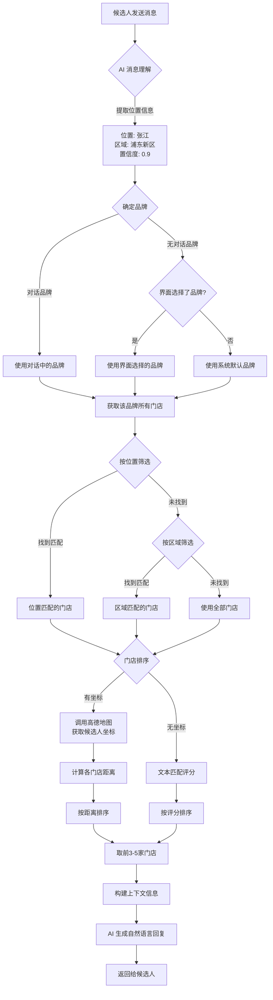

# 门店智能匹配逻辑说明

> 本文档面向招聘BP运营同学，解释系统如何根据候选人提问的地点，智能匹配到合适的门店。

## 一、整体流程概览

```
┌─────────────────────────────────────────────────────────────────────────────┐
│                         候选人发送消息                                        │
│                    "我住在浦东新区张江，附近有门店吗？"                          │
└─────────────────────────────────────────────────────────────────────────────┘
                                    │
                                    ▼
┌─────────────────────────────────────────────────────────────────────────────┐
│  第一步：消息理解                                                             │
│  ────────────────                                                           │
│  AI 识别出：                                                                 │
│  • 位置信息：张江（置信度 0.9）                                                │
│  • 区域信息：浦东新区（置信度 0.95）                                           │
│  • 意图类型：位置咨询                                                         │
└─────────────────────────────────────────────────────────────────────────────┘
                                    │
                                    ▼
┌─────────────────────────────────────────────────────────────────────────────┐
│  第二步：品牌确定                                                             │
│  ────────────────                                                           │
│  确定要推荐哪个品牌的门店：                                                    │
│  • 优先使用运营选择的品牌（在界面上选的）                                        │
│  • 或从对话中提取的品牌                                                        │
│  • 最后使用系统默认品牌                                                        │
└─────────────────────────────────────────────────────────────────────────────┘
                                    │
                                    ▼
┌─────────────────────────────────────────────────────────────────────────────┐
│  第三步：门店筛选                                                             │
│  ────────────────                                                           │
│  从该品牌的所有门店中，筛选出符合条件的：                                        │
│  • 先按"张江"匹配 → 找到 3 家门店                                             │
│  • 如果没匹配到，再按"浦东新区"匹配                                            │
└─────────────────────────────────────────────────────────────────────────────┘
                                    │
                                    ▼
┌─────────────────────────────────────────────────────────────────────────────┐
│  第四步：门店排序                                                             │
│  ────────────────                                                           │
│  【方式A】距离排序（推荐）                                                     │
│    1. 调用高德地图，把"张江"转成坐标                                           │
│    2. 计算每家门店到张江的直线距离                                             │
│    3. 按距离从近到远排序                                                      │
│                                                                             │
│  【方式B】文本匹配排序（备用）                                                  │
│    如果高德地图无法识别位置，按文字匹配程度排序                                   │
└─────────────────────────────────────────────────────────────────────────────┘
                                    │
                                    ▼
┌─────────────────────────────────────────────────────────────────────────────┐
│  第五步：生成回复                                                             │
│  ────────────────                                                           │
│  把排序后的门店信息给 AI，生成自然语言回复：                                     │
│  "张江附近有3家门店，最近的是张江店（约1.2公里）..."                             │
└─────────────────────────────────────────────────────────────────────────────┘
```

---

## 二、详细步骤说明

### 2.1 第一步：消息理解（AI 智能识别）

当候选人发送消息时，系统会用 AI 自动识别以下信息：

| 识别内容     | 说明                           | 示例                         |
| ------------ | ------------------------------ | ---------------------------- |
| **位置信息** | 具体地点（小区、商圈、地标等） | 张江高科、世纪公园、万达广场 |
| **区域信息** | 行政区划（区、街道等）         | 浦东新区、徐汇区、静安寺街道 |
| **城市信息** | 工作城市                       | 上海、北京、深圳             |
| **置信度**   | AI 对识别结果的把握程度（0-1） | 0.9 表示 90% 确定            |

**示例：**

候选人消息："我家在浦东张江那边，你们有门店吗？"

AI 识别结果：

- 位置：`张江`（置信度 0.85）
- 区域：`浦东`（置信度 0.90）
- 意图：`位置咨询`

---

### 2.2 第二步：品牌确定

系统采用 **"Smart" 智能策略** 来解决品牌冲突，确保推荐最符合用户意图的品牌。

**品牌来源：**

1. **对话提取**：从候选人消息或当前岗位上下文中提取的品牌（例如候选人问"肯德基招人吗"）。
2. **UI选择**：运营在界面左上角选择的品牌。
3. **系统默认**：配置中设置的默认品牌。

**智能决策逻辑：**

```mermaid
graph TD
    A{对话中是否提取到品牌?} -->|是| B{UI是否也选择了品牌?}
    A -->|否| C{UI是否选择了品牌?}

    B -->|是| D{两者是否冲突?}
    D -->|是| E[智能判断: 优先使用对话提取的品牌<br>(更符合当前上下文意图)]
    D -->|否| F[使用该品牌]

    B -->|否| G[使用对话提取的品牌]

    C -->|是| H[使用UI选择的品牌]
    C -->|否| I[使用系统默认品牌]
```

**核心原则：**

- **上下文优先**：如果候选人明确问了某个品牌，即使运营选了另一个，系统也会优先回答候选人关心的品牌。
- **同系列处理**：如果对话品牌和UI品牌属于同一系列（如"百胜"和"肯德基"），优先使用更具体的对话品牌。

---

### 2.3 第三步：门店筛选

确定品牌后，系统会从该品牌的门店库中筛选。在此之前，系统会先进行**城市推断**。

**1. 城市推断 (City Inference)**
系统需要知道在哪个城市找门店。逻辑如下：

1. **显式提及**：如果候选人说了城市（"我在上海"），直接使用该城市。
2. **门店 city 字段**：如果候选人没说，系统会收集该品牌所有门店的 `city` 字段，取出现次数最多的城市。
   - 例如：10 家门店中 8 家在上海、2 家在苏州 → 返回"上海"
3. **地址提取**：如果门店没有 `city` 字段，从门店地址中提取城市名（如 `"上海市浦东新区..."` → `"上海"`）。
4. **兜底值**：以上都无法获取时，返回"当地"。

**2. 筛选逻辑（按优先级）**

```
第一优先级：按"位置"筛选
├── 如果识别到位置（如"张江"），找包含该位置的门店
├── 匹配字段：门店名称、详细地址、商圈、行政区
└── 找到就用这批门店

        ↓ 如果没找到

第二优先级：按"区域"筛选
├── 如果识别到区域（如"浦东新区"），找该区域的门店
├── 匹配字段：区域字段、商圈字段
└── 找到就用这批门店

        ↓ 如果还没找到

第三优先级：按"岗位地址"筛选
├── 使用候选人应聘的岗位发布地址
└── 作为最后的过滤条件
```

**示例：**
假设品牌有 20 家门店：

1. 系统推断城市为"上海"。
2. 按"张江"筛选 → 找到 3 家。
3. 最终参与排序的是这 3 家门店。

---

### 2.4 第四步：门店排序

这是最关键的一步，决定了推荐给候选人的门店顺序。

#### 方式A：距离排序（主要方式）

```
候选人位置："张江"
         │
         ▼
┌─────────────────────┐
│  调用高德地图 API    │
│  "张江" → 坐标      │
│  (121.60, 31.20)   │
└─────────────────────┘
         │
         ▼
┌─────────────────────────────────────────┐
│  计算每家门店到候选人的距离              │
│                                         │
│  张江店     → 1.2 公里                  │
│  金桥店     → 3.5 公里                  │
│  世纪公园店 → 5.8 公里                  │
└─────────────────────────────────────────┘
         │
         ▼
    按距离从近到远排序
```

**距离计算方法：**

- 使用"直线距离"（Haversine 公式）
- 不是导航距离，是两点间的最短距离
- 单位：米/公里

#### 方式B：文本匹配排序（备用方式）

如果高德地图无法识别位置（比如候选人说的是小区名、方言地名等），系统会用文本匹配：

```
评分维度（满分100分）：

位置匹配（40分）
├── 门店名称包含"张江" → +40分
├── 门店地址包含"张江" → +35分
└── 商圈包含"张江" → +30分

区域匹配（30分）
├── 门店区域是"浦东新区" → +30分
└── 商圈在浦东 → +25分

岗位多样性（20分）
└── 门店岗位种类越多，分数越高

岗位可用性（10分）
└── 有空缺岗位的门店分数更高
```

---

### 2.5 第五步：生成回复

系统把筛选和排序后的门店信息，交给 AI 生成自然语言回复。为了控制回复的长度和重点，系统引入了 **"信息详细级别" (Detail Levels)**。

**信息详细级别：**

| 级别                | 适用场景                     | 包含信息                                     |
| ------------------- | ---------------------------- | -------------------------------------------- |
| **Minimal (精简)**  | 初次咨询、位置咨询           | 门店名、距离、职位名、基础薪资、排班类型     |
| **Standard (标准)** | 薪资咨询、面试邀约、一般对话 | + 奖金、部分福利、排班特点                   |
| **Detailed (详细)** | 排班咨询、考勤咨询、兼职咨询 | + 完整福利、考勤政策、具体工时要求、换班规则 |

**AI 收到的信息示例 (Standard级别)：**

```
品牌：肯德基

匹配到的门店信息：
• 张江高科店【距离约1.2公里】（浦东新区张江）：上海市浦东新区张江高科技园区XX路XX号
  职位：服务员
  时间：09:00-18:00、18:00-02:00等
  薪资：22元/时，范围22-25元
  排班：灵活排班（可换班）
  福利：免费工作餐、住房补贴

• 金桥店【距离约3.5公里】（浦东新区金桥）：上海市浦东新区金桥路XX号
  ...
```

**AI 生成的回复示例：**

> 你好，张江附近有门店在招人的～最近的是张江高科店，离你大概1公里多，在招服务员，时薪22-25元，排班比较灵活，还提供工作餐。金桥那边也有一家，稍微远一点，你方便的话可以去店里看看～

---

## 三、常见问题

### Q1: 为什么有时候匹配不到门店？

**可能原因：**

1. 候选人说的位置比较模糊（如"市中心"）
2. 该区域确实没有该品牌的门店
3. 位置名称是方言或非标准说法

**系统处理：**

- 会提示"暂无完全匹配的门店"
- 推荐其他区域的门店
- 引导候选人添加微信，后续有合适门店再推送

### Q2: 距离准确吗？

**说明：**

- 显示的是"直线距离"，不是导航距离
- 实际通勤距离可能更长
- 建议回复时说"大概"、"约"

### Q3: 门店排序的依据是什么？

**排序优先级：**

1. 如果能获取坐标 → 按真实距离排序
2. 如果无法获取坐标 → 按文本匹配度排序

### Q4: 为什么有的门店显示距离，有的不显示？

**原因：**

- 显示距离：系统成功获取了候选人位置坐标
- 不显示距离：无法识别位置，使用文本匹配

---

## 四、运营建议

### 4.1 提高匹配准确率

1. **完善门店数据**
   - 确保每家门店的地址、区域、商圈信息完整
   - 门店坐标要准确（用于距离计算）

2. **使用标准地名**
   - 区域用标准行政区划名称
   - 商圈用常用名称

### 4.2 处理无匹配情况

当系统提示"无匹配门店"时：

1. 主动询问候选人更具体的位置
2. 推荐相邻区域的门店
3. 引导添加微信，后续跟进

### 4.3 优化回复效果

1. 回复中提到距离时加"大概"、"约"
2. 推荐 2-3 家门店即可，不要太多
3. 重点突出最近的那家门店

---

## 五、技术名词解释

| 名词         | 解释                                       |
| ------------ | ------------------------------------------ |
| 置信度       | AI 对识别结果的把握程度，0.9 表示 90% 确定 |
| 直线距离     | 两点之间最短距离，不考虑道路               |
| 地理编码     | 把地址文字转成坐标的过程                   |
| POI          | Point of Interest，兴趣点，如商场、小区名  |
| 高德地图 API | 提供地址转坐标服务的接口                   |

---

## 六、流程图（技术视角）



---

_文档更新日期：2024年_
_如有问题请联系技术团队_
